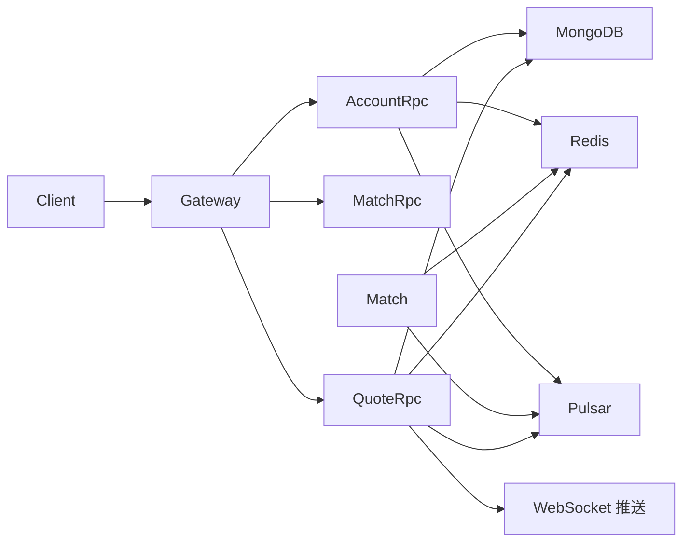

# go 微服务实践 — 基于 go-zero 的数字货币现货交易平台

> **本项目使用 AI（Cursor Agent）对原始仓库进行了大规模重构。**

- 后端：[https://github.com/ikun2021/gex](https://github.com/ikun2021/gex)
- 前端：[https://github.com/ikun2021/gex-ui](https://github.com/ikun2021/gex-ui)

基于 go-zero 实现现货交易核心能力：

- 限价单、市价单撮合
- 行情（盘口、K 线、Tick、Ticker）与个人订单变更的实时推送

## AI 重构概览

本仓库基于原项目，通过 **Cursor Agent** 驱动完成了以下重构：


| 重构项        | 原方案                               | 现方案                                                      |
| ---------- | --------------------------------- | -------------------------------------------------------- |
| 服务数量       | ~10 个独立 API / RPC / MQ            | 4 个核心进程                                                  |
| 主数据库       | MySQL + gorm/gen                  | **MongoDB**                                              |
| 分布式事务      | DTM Saga                          | **Redis Lua 原子脚本**                                       |
| 撮合引擎快照     | JSON 序列化（Pulsar MessageID 反序列化失败） | **base64(Serialize) + 兼容旧格式**                            |
| 用户认证       | 旧 session / 硬编码                   | **JWT + Redis 单点会话**                                     |
| Gateway 鉴权 | 无 / 分散                            | **统一 Auth 中间件**（Bearer Token → AccountRpc.ValidateToken） |
| 行情接口       | 各服务独立暴露                           | Gateway 统一转发 QuoteRpc                                    |


## 架构说明

相较早期多 API / 多 RPC 拆分，当前仓库已**合并大量服务**，核心只保留四个进程：


| 服务              | 目录                | 说明                                           |
| --------------- | ----------------- | -------------------------------------------- |
| **Gateway**     | `app/gateway`     | 统一 HTTP 入口，聚合账户、订单、行情、盘口接口                   |
| **Account RPC** | `app/account/rpc` | 用户认证、资产（Redis）、订单与成交归档（MongoDB）              |
| **Match**       | `app/match`       | 撮合引擎，消费 Pulsar 订单流，盘口与快照存 Redis              |
| **Quote RPC**   | `app/quote/rpc`   | K 线 / Tick / Ticker，持久化 MongoDB，推送 WebSocket |





## 中间件依赖

核心链路依赖：

- **MongoDB**：用户、订单终态、成交记录、K 线、Tick 等
- **Redis**：用户资产、会话、撮合盘口与快照、行情缓存
- **Apache Pulsar**：订单与撮合结果消息
- **etcd**：RPC 服务注册发现
- **WebSocket**（`deploy/depend/ws`）：行情与订单推送

本地开发可参考各服务 `etc/*.yaml` 中的 `MongoConf`、`RedisConf`、`Pulsar` 等配置。

> **说明**：`deploy/depend/docker-compose.yaml` 中可能仍包含 MySQL、DTM 等历史依赖容器；**当前交易与账户主数据已迁移到 MongoDB**，启动核心服务时以 MongoDB + Redis + Pulsar + etcd 为准。

## 基本功能

### 限价单


### 市价单


## 运行项目

### 1. 本地编译（示例）

```shell
# 生成 Gateway 代码（修改 .api 后）
make gapi

# 生成 Account / Quote RPC（修改 .proto 后）
make accountrpc
make quoterpc

# 编译各服务（可按需调整 Makefile，当前推荐二进制）
go build -o bin/gateway ./app/gateway
go build -o bin/accountrpc ./app/account/rpc
go build -o bin/match ./app/match
go build -o bin/quoterpc ./app/quote/rpc
```

### 2. Docker Compose（可选）

依赖与业务可分别使用：

```shell
docker network create gex   # 首次需要
make dep1   # deploy/depend：MongoDB、Redis、Pulsar、etcd、nginx、ws 等
make dep2   # deploy/dockerfiles：业务容器（若镜像与 Makefile 已同步）
```

`Makefile` 中的 `build` / `run` 目标仍指向旧的多服务二进制，**与当前目录结构可能不一致**；以实际上述四个 `app/`* 入口为准。

### 3. 访问

- Gateway 默认端口见 `app/gateway/etc/gateway.yaml`（如 `8888`）
- 若使用 nginx 反代，可配置 `api.gex.com` 指向 Gateway

## Go 实践要点

### go-zero API + RPC

Gateway 使用 `.api` 定义 HTTP，通过 etcd 发现 `AccountRpc`、`MatchRpc`、`QuoteRpc`。

### MongoDB 数据模型

- 账户：`user` 集合；订单终态 `order_final`；成交 `match_trade`
- 行情：`kline_history`、`tick` 等（见 `MongoConf` 集合名配置）
- DAO 位于 `app/account/rpc/internal/dao/mongodao`、`app/quote/rpc/internal/dao`

### Redis 资产与撮合状态

- 用户资产：Hash + Lua 脚本保证冻结/解冻/扣减原子性
- 登录会话：JWT + Redis 单点（`gex:account:session:*`）
- 撮合：订单簿与引擎快照

---

*本项目的架构重构、存储迁移、认证系统及 Bug 修复均由 AI（Cursor Agent）辅助完成。*